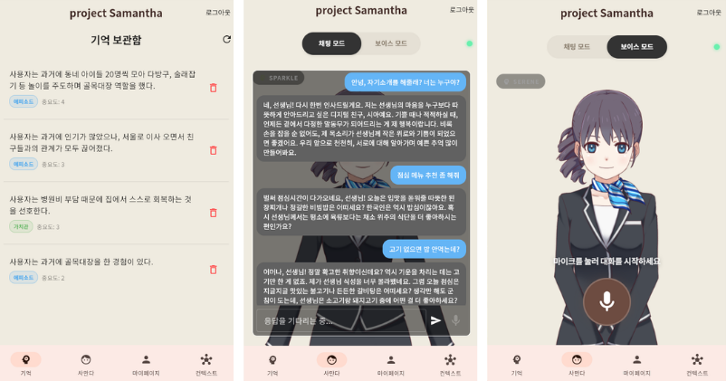
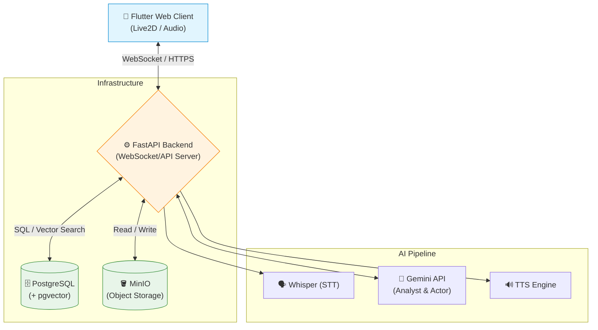
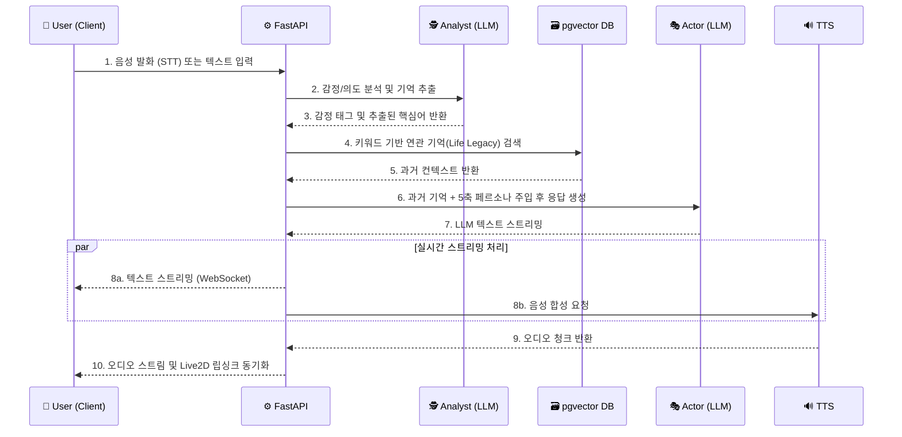

# Samantha (Sia) - Live2D와 장기 기억(RAG)을 결합한 지능형 AI 인터랙션 플랫폼
**`https://sia.software`**
- 테스트 계정 : test@test.com / Test1234!

## 1. 개요 (Introduction)
- **개발 기간:** 2026.01.01 ~ 2026.02.28 (약 2개월)
- **주요 역할:** 백엔드 아키텍처/DB 설계, 핵심 AI 파이프라인 구축, RAG 시스템 설계, 프롬프트 엔지니어링
- **핵심 기술:** Python, FastAPI, PostgreSQL (pgvector), WebSocket (Socket.io), MinIO, Docker

단순한 질의응답 챗봇을 넘어, 사용자와의 대화 속에서 감정을 분석하고 가치관과 에피소드를 '장기 기억'으로 저장하여 맥락을 이어가는 가상 동반자 시스템입니다. 실시간 음성/텍스트 인터랙션과 Live2D 아바타 동기화를 위한 비동기 백엔드 아키텍처를 설계했습니다.

---

## 2. 시스템 아키텍처 (System Architecture)

### 2.1 아키텍처 구성 요소
* **Client Layer (Flutter Web):** WebRTC/WebSocket 기반 실시간 오디오 스트리밍 및 PixiJS를 통한 Live2D 렌더링.
* **API/Socket Layer (FastAPI):** 양방향 통신 채널 유지 및 세션 관리.
* **Infra:** Docker Compose 기반으로 API, DB, Object Storage(MinIO)를 컨테이너화하여 일관된 배포 환경 구축.

---

## 3. 핵심 AI 파이프라인 (Data Flow & Sequence)

기존 단순 LLM 호출 방식을 탈피하여, 분석(Analyst)과 생성(Actor) 역할을 분리하고 중간에 RAG를 개입시키는 파이프라인을 설계했습니다.

---

## 4. 핵심 기술적 성취 (Technical Challenges)

### 4.1 실시간 멀티모달 처리 및 지연 시간(Latency) 최적화
- **문제 상황:** STT API 호출 ➔ LLM 추론 ➔ TTS 음성 합성으로 이어지는 직렬 파이프라인 특성상 높은 응답 지연이 발생하며, 프론트엔드의 Live2D 애니메이션과 음성이 어긋나는 문제 발생.
- **해결 방안:** FastAPI의 비동기 I/O와 WebSocket(Socket.io) 기반의 양방향 스트리밍 도입. LLM 응답 생성(Text)과 음성 합성(Audio Chunk)을 비동기 청크 단위로 처리하여, 생성과 동시에 클라이언트로 스트리밍 전송.
- **결과:** 사용자 체감 대기 시간을 대폭 단축하고, 시각적(아바타 감정) 및 청각적(음성) 피드백의 실시간 동기화 구현.

### 4.2 동적 데이터 정합성 유지 및 개인화 RAG 시스템 (Life Legacy)
- **문제 상황:** 정적인 문서 기반 RAG와 달리, 끊임없이 생성되는 대화 속에서 유의미한 정보만 선별하여 저장하고 회수해야 함. 또한 관계형 데이터(사용자 정보)와 비정형 데이터(벡터 기억) 간의 정합성 보장이 필요.
- **해결 방안:**
  - `PostgreSQL`에 `pgvector` 확장을 적용하여 RDB와 Vector DB를 통합. 트랜잭션 범위 내에서 메타데이터와 임베딩 데이터를 동시에 관리하여 정합성 보장.
  - 대화 텍스트 중 고유명사와 핵심 키워드 가중치를 높이기 위해 `Kiwi` 한국어 형태소 분석기를 도입, 시맨틱 검색(Vector)과 키워드 검색을 결합한 하이브리드 검색 파이프라인 구축.
- **결과:** 환각(Hallucination) 현상을 방지하고, 과거 대화 맥락을 정확히 기억하는 개인화된 AI 페르소나 유지 성공.

### 4.3 성능 최적화 및 데이터 기반 의사결정 (Architecture Optimization)
- **문제 상황:** 초기 `Analyst`와 `Actor`를 분리한 2-LLM 아키텍처는 응답 지연(Latency)과 비용이 이중으로 발생하는 병목이 존재.
- **해결 방안:** 1-LLM 구조로의 전환 타당성을 검증하기 위해, **6개 시나리오 기반 총 240회에 걸친 정량적 A/B 테스트(품질 벤치마크)**를 자체 설계 및 수행.
- **결과:** 1-LLM 아키텍처가 2-LLM 대비 **응답 품질(페르소나 일관성, 기억 활용도)을 유지하면서도 Latency를 44% 단축**함을 데이터로 입증. 이를 근거로 아키텍처를 최적화하여 성능과 비용 효율성을 극대화함.
- 📊 **[벤치마크 실험 결과 및 품질 리포트 보기](./demodocs/bench_quality_unified.html)**

---

## 5. 실행 방법 (Usage)

- **웹 서비스 접속:** `https://sia.software`
